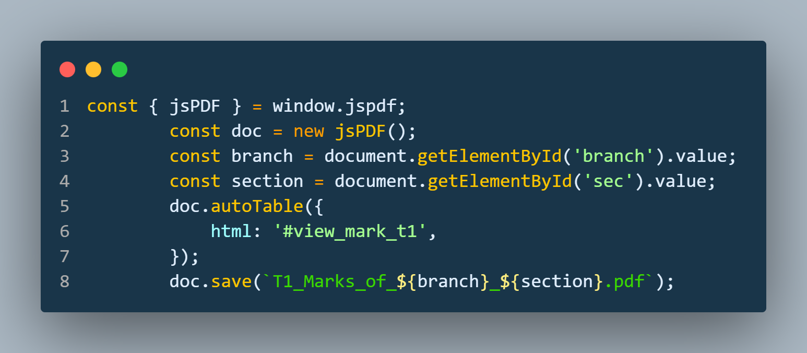

# 🎓 EduTracker

**EduTracker** is a web-based academic management system that helps students and teachers efficiently track and manage attendance and exam performance.

---

## 📌 Overview

EduTracker allows students to monitor their **daily attendance** and **exam marks** across tests like `T1`, `T2`, `T3`, `M1`, and `M2`.  
The platform also empowers teachers to upload marks, record attendance, and view insightful performance analysis.

---

## 👥 User Roles

### 🧑‍🎓 Student
- View personal attendance records.
- Track performance in **T1**, **T2**, **T3**, **M1**, and **M2** exams.

### 👨‍🏫 Teacher
- Upload student marks for all exams.
- Record and manage daily attendance.
- View analytical insights and trends based on student performance.

### 👨‍💼 Admin
- Register and manage student and teacher accounts.
- Provide login credentials to users after registration.

---

## 🔐 Authentication Flow

1. **Registration**: Admin registers students and teachers manually.
2. **Login**: Users receive their credentials and can log in to access their respective dashboards.

---

## 💡 Features

- 🔐 Secure login system for students and teachers.
- 📅 Attendance tracking on a daily basis.
- 📝 Marks entry for T1, T2, T3, M1, and M2 exams.
- 📊 Visual analysis of student marks for teachers.
- 👨‍💼 Admin dashboard for user onboarding and management.

---

## 🛠️ Tech Stack

- **Frontend**: Blade(PHP), Laravel, HTML, CSS, Bootstrap, JavaScript
- **Backend**: PHP, Node.js
- **Database**:  MySQL
- **Libraries/Tools**: Chart.js (for analysis), bcrypt (for password hashing), jsPDF(for PDF generation).

---
## Code for the PDF Generation...
Add These Below CDN's inside you file...

    
    
    

And Also Install the NodeJS Package...

    npm install jspdf --save

  

